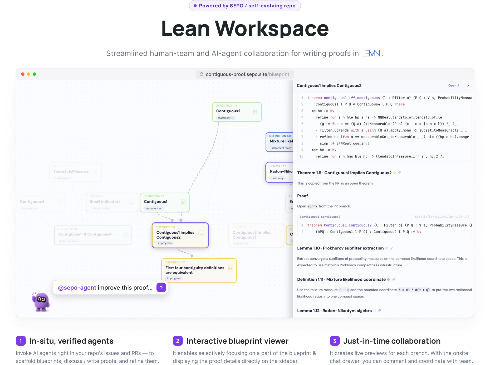

**Lean Workspace** is a template for formalizing theorems in Lean where human teams and AI agents work side by side — plan a proof as a blueprint, formalize it in Lean, and collaborate right in the repository.

- **In-situ agent support** — invoke AI agents right in your repo's issues and PRs to scaffold blueprints, discuss / write proofs, and refine them.
- **Interactive blueprint viewer** — selectively focus on part of the blueprint and read the proof details right in the sidebar.
- **Just-in-time collaboration** — live previews for each branch, plus an on-site chat drawer to comment and coordinate with your team.

## Explore the docs

- **[Tutorial](tutorial/)** — get proving, locally or straight from GitHub.
- **[Documentation](documentation/)** — authoring styles, chapter grammar, configuration, and the build.
- **[Demo proof](blueprint)** — a worked example that exercises both authoring styles.
