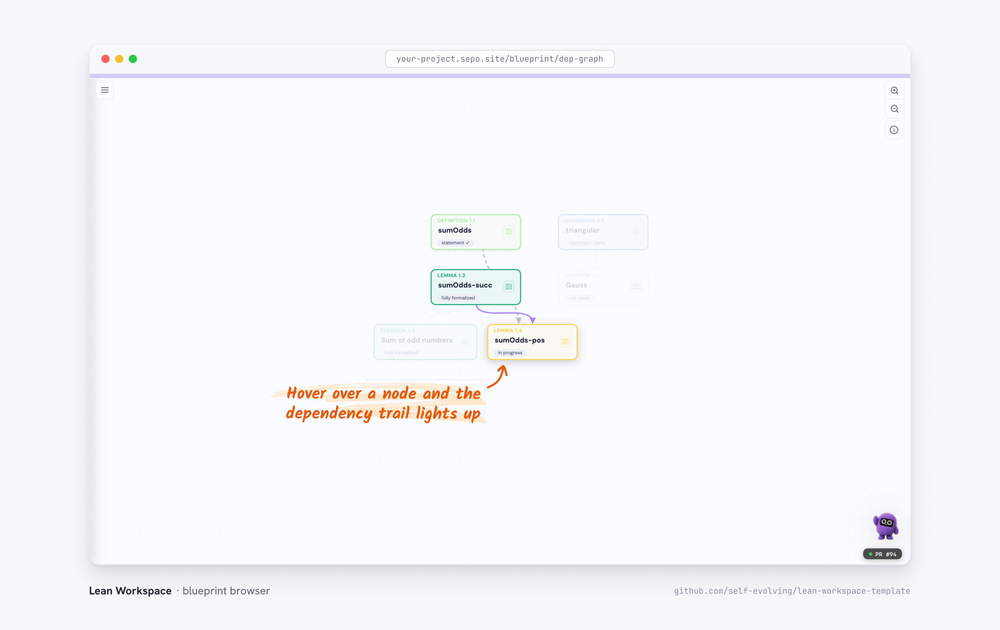
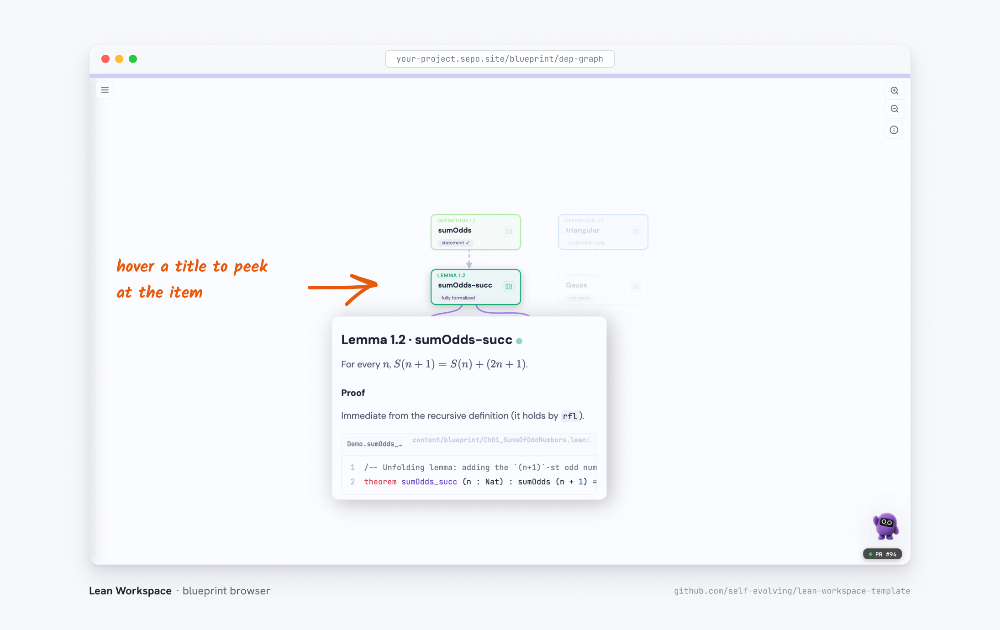
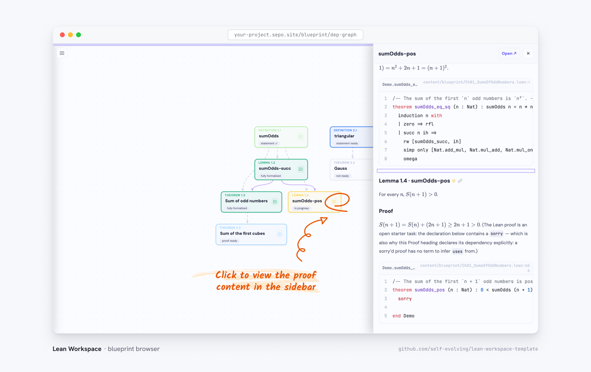

Every blueprint ships with an interactive dependency canvas at
`/blueprint/dep-graph` — one card per definition, lemma, or theorem, colored
by its kernel-computed
[status](../../documentation/reference#status-model-kernel-computed), with
statement dependencies drawn dashed and proof dependencies solid.

## Hover to trace the dependency trail

Hovering a node focuses its neighborhood: the node and the nodes it directly
depends on stay lit while the rest of the canvas fades back. It is the
quickest way to answer "what does this lemma actually need?"

## Peek at an item from its title

Hovering a card's _title_ goes one step further: a popup shows the item
itself — statement, prose proof, and the Lean declaration — so you can read
a proof without committing to a click.

## Open the proof without leaving the canvas

The ▸ button on a card opens the item in a side panel: statement, prose
proof, and the real Lean source pulled from the kernel data. **Open ↗** in
the panel header takes you to the full chapter page.

And when you want the full context, a card's title links straight to the
item's anchor on its chapter page — which carries the same signals as the
canvas: a status dot per item, the declaration's source inlined under it,
and a local blueprint graph in the right rail.
