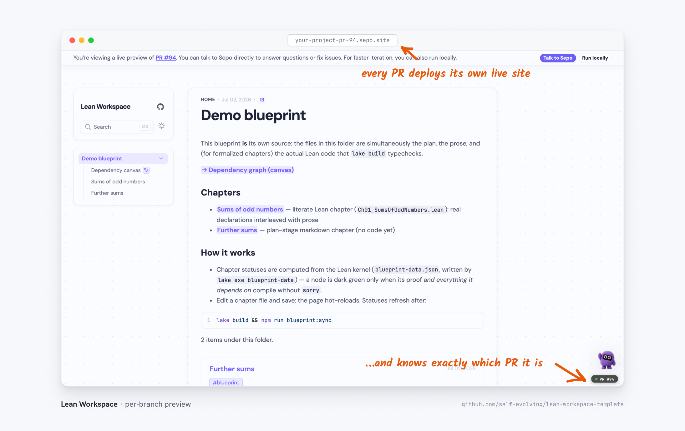
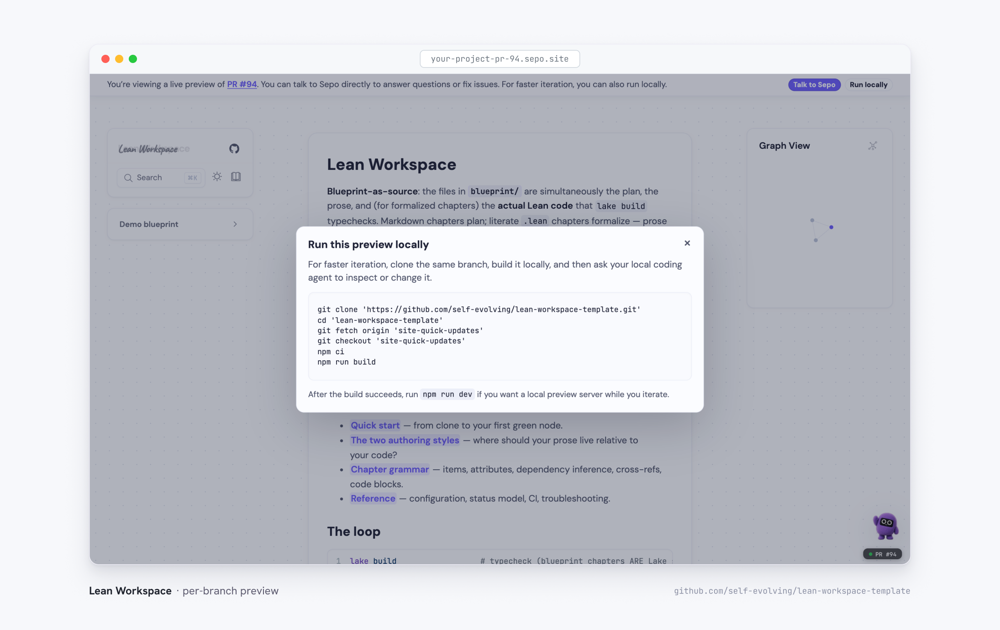

Reviewing a proof PR from the diff alone is hard: what you actually want to
see is the blueprint after the change — which nodes turned green, how the new
chapter reads. Per-branch previews deploy exactly that: a full copy of the
site built from the PR's branch, at its own URL.

## Turning it on

With the [Sepo setup](../quick-start), previews ship with the template's
workflow stack: add the `sepo-preview` label to a pull request from a branch
in this repository, and `agent-site-preview.yml` builds the branch and
publishes the URL as a GitHub _Preview_ deployment on the PR (marked inactive
again when the PR closes).
The URL lives in the PR's **Deployments** box — the "View deployment" button
in the sidebar, next to the checks. No extra configuration is needed — the
workflow fills in the
[build environment](../../documentation/configuring-sepo) for you. Agent PRs
(branches starting with `agent/`) deploy automatically, no label needed.

So the whole flow from a local checkout is: push your branch, open a PR, add
the `sepo-preview` label, and follow "View deployment" a couple of minutes
later. CI also pushes regenerated blueprint data back to the branch — run
`git pull --ff-only` before your next local commit. Both halves are for
branches in this repository only: fork PRs are built and validated by CI,
but get neither a preview deployment nor the data push-back.

## The preview banner

A preview knows which PR it belongs to. A banner across the top links back to
the pull request and offers to bring Sepo into the conversation, and the
[drawer](sepo-agent-drawer) in the corner carries a `PR #N` badge and
deep-links to that PR's thread.

## From preview to local iteration

For faster iteration than the deploy loop, **Run locally** in the banner
hands you the exact commands to clone the same branch and serve it with hot
reload — handy for you, and for pointing a local coding agent at the branch.

