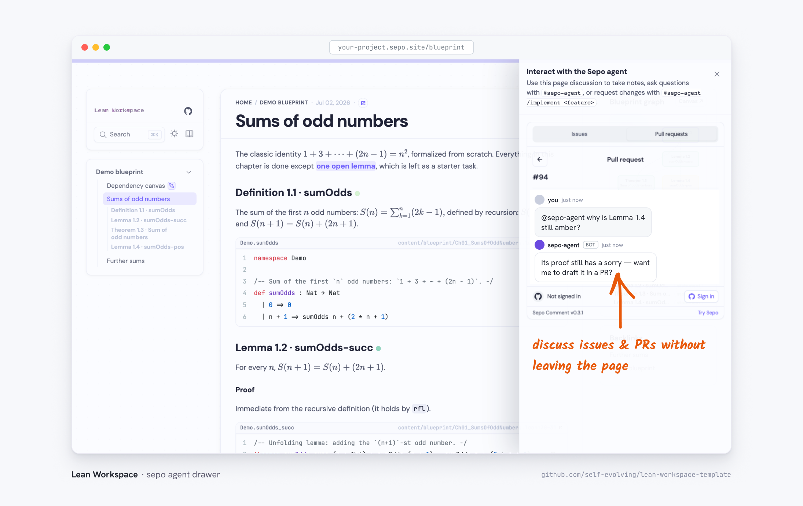

The purple mascot in the corner of every page opens the Sepo drawer: the
repository's conversations, embedded in the site. Each page has its own
discussion thread, and the drawer's tabs list the repository's Discussions,
Issues, and Pull requests (the tabs adapt to what the repository has
enabled).

Anything you write there is a real GitHub comment, so the agent workflows
react to it exactly as they do on github.com:

- mention `@sepo-agent` with a question to get an answer in the thread;
- write `@sepo-agent /implement <change>` to dispatch the agent, which opens
  a pull request with the change;
- use a page's own thread to keep notes anchored to the chapter they are
  about.

On a [per-branch preview](per-branch-preview), the drawer is pinned to the
pull request being previewed, so review discussion happens next to the
rendered result. Posting uses your GitHub account — the drawer asks you to
sign in the first time — and private repositories require sign-in to read
the embedded threads as well.

The drawer runtime is served by the Sepo comments service; see
[configuring Sepo](../../documentation/configuring-sepo) for the knobs —
which tabs show, which repository the threads live in, and how previews are
wired.
