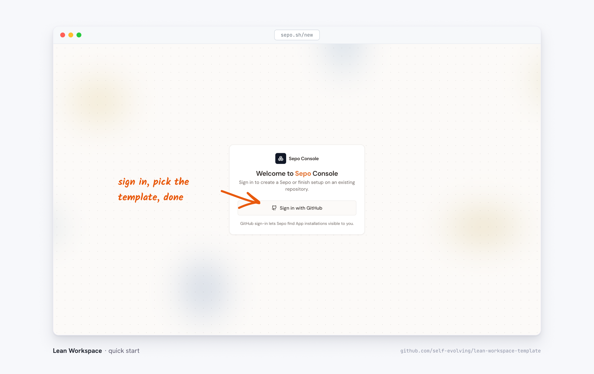

Lean Workspace is a GitHub template: every project starts as a copy of
[lean-workspace-template](https://github.com/self-evolving/lean-workspace-template).
The fastest way to set one up is the
[Sepo onboarding flow](https://app.sepo.sh/new?path=template&template=lean-workspace),
which creates the repository and wires up the agent infrastructure in a few
clicks: AI agents that answer questions and implement changes right in your
issues and PRs, a compile check for every change, and a (private) website for
your project with a live preview per branch.



> [!note]- Install it without Sepo support?
> If you only want the minimal blueprint support, use
> [lean-workspace-template](https://github.com/self-evolving/lean-workspace-template)
> as a regular GitHub template ("Use this template") and skip the Sepo setup.
> The [local workflow](#locally) below works the same either way.

_Already have a blueprint elsewhere? See
[migrate an existing blueprint](migrate-existing-blueprint). Here to work on
an existing Lean repo, issue, or PR? See
[work on an external Lean project](work-on-external-project)._

## Two ways to work

With Sepo set up you can drive the whole workspace from GitHub — no local
clone required — or clone it and prove locally. Most projects mix both.

### On GitHub

1. **Open an issue** — the templates pre-fill the dispatch, and it forks two
   ways. _Ask Sepo_ starts a **discussion** (`/answer`). _Plan a blueprint_,
   _Work on a proof_, and _Golf a proof_ send `@sepo-agent /implement`, which
   goes **straight to a pull request** — no discussion round. To talk it
   through first, swap `/implement` for `/answer` on the template's first
   line.
2. **Discussing first?** The agent replies with a proof sketch and suggested
   follow-up steps; keep the thread going until the plan looks right, then
   comment `@sepo-agent /implement …` to dispatch.
3. **The agent opens a pull request** implementing the change, linked back to
   the issue.
4. **Review on the live preview.** The PR gets its own deployed copy of the
   site ([per-branch preview](../features/per-branch-preview)), so you watch
   nodes change status before merging.

The same conversation also works from the site itself, through the
[Sepo agent drawer](../features/sepo-agent-drawer).

### Locally

You need two tools:

- [elan](https://github.com/leanprover/elan) — the Lean version manager; the
  pinned toolchain installs automatically on first build
- Node.js 22 or newer

```bash
lake build     # typecheck the blueprint chapters (they ARE Lake source)
npm install    # frontend dependencies
npm run dev    # local site at http://localhost:8080, hot reload
```

Success looks like: `lake build` ends with `Build completed successfully` —
the `declaration uses 'sorry'` warning it prints on the way is expected,
that's the demo's one open lemma — and `npm run dev` settles at
`Started a Quartz server listening at http://localhost:8080`.

If a command fails, the
[troubleshooting list](../../documentation/local-setup#troubleshooting)
covers the three usual causes — Node older than 22, elan not installed, or a
mathlib project compiling from source.

Edit any chapter file (`content/blueprint/*.md` or `*.lean`) and the page
hot-reloads instantly. Statuses move on a second clock: after you prove
something (say, replace a `sorry`), re-run

```bash
lake build && npm run blueprint:sync
```

and the node statuses and canvas colors catch up with the kernel. While
`npm run dev` is running, the same terminal watches for Lean edits and
prompts you — press `s` + Enter there to run exactly this re-sync. The
[local setup](../../documentation/local-setup) page walks through this loop
in detail, and [writing your first proof](writing-your-first-proof) uses it
to turn the demo's one open lemma green.

## Next steps

- [Writing your first proof](writing-your-first-proof) — prove the demo's
  open lemma and watch its node turn green.
- [The two proof-writing styles](../writing-proofs/two-styles-of-proving) —
  where your prose lives relative to your code.
- [Blueprint browser](../features/blueprint-browser) — reading the dependency
  canvas.
- [Local setup](../../documentation/local-setup) — the full local loop,
  adding chapters, and pointing at your own library.
